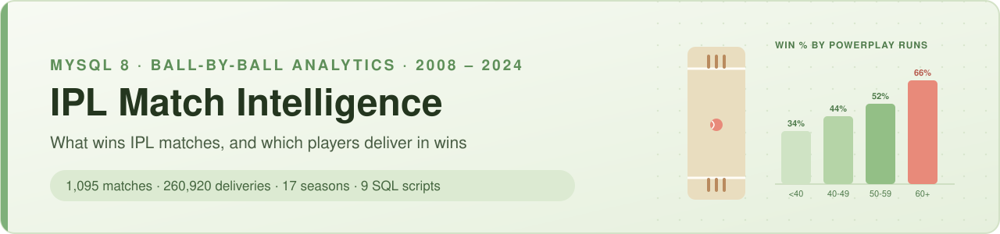
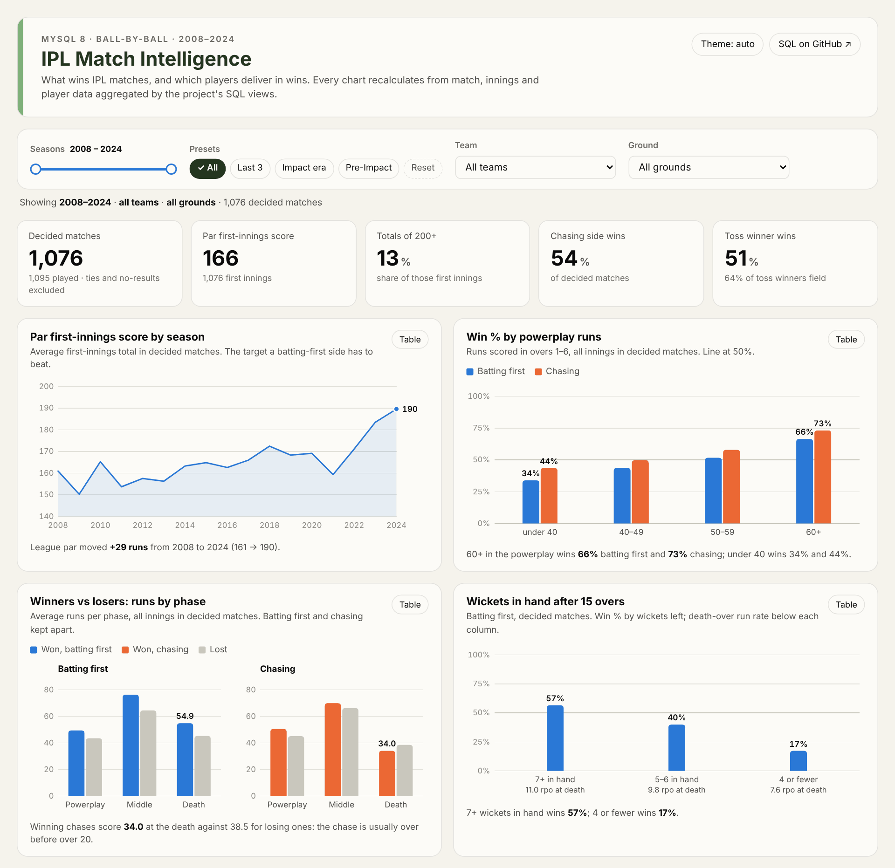
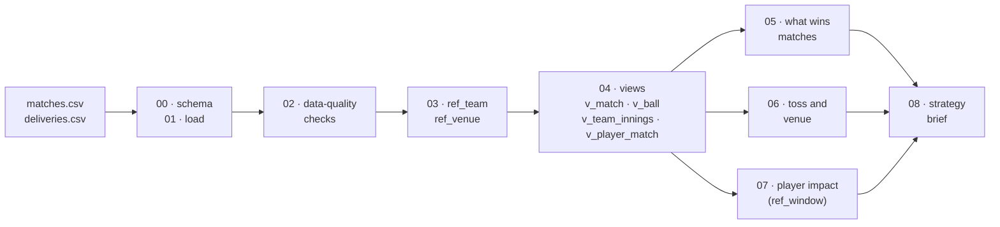

<p align="center">

</p>

<p align="center">


<a href="https://tanmaymandal0207-cmyk.github.io/IPL-Match-Intelligence-Player-Impact-Analysis/dashboard/"></a>
</p>

<p align="center">
<a href="#strategy-brief">Strategy brief</a> ·
<a href="#dashboard">Dashboard</a> ·
<a href="#pipeline">Pipeline</a> ·
<a href="#findings">Findings</a> ·
<a href="#data-model">Data model</a> ·
<a href="#how-to-run">How to run</a> ·
<a href="#what-changed-from-v1">Changes</a>
</p>

---

## Overview

A SQL practice project built around one question a franchise analyst would be asked before a season:

> **What wins IPL matches, and which players deliver in wins?**

The answer comes from 17 seasons of ball-by-ball data (2008–2024), worked through in MySQL 8 in nine numbered scripts. The scripts load the data, check it, standardise team and ground names, build reusable views, analyse match-winning factors, the toss and venues, and player impact, and finally combine everything into a single **strategy brief**.

**Skills practised:** schema design · `LOAD DATA` with cleaning · data-quality reconciliation · mapping tables · layered views · CTEs · window functions · conditional aggregation · parameterised analysis

---

## Strategy brief

The output of [`08_strategy_brief.sql`](sql/08_strategy_brief.sql). It is one result set, and every number is calculated live from the views.

| Area | Finding | Recommendation |
|---|---|---|
| Batting target | Par first-innings score in 2024 is **190**; 37% of totals reached 200 | Plan for 200: par has risen 18 runs since 2022 |
| Powerplay | Teams scoring **60+ in overs 1–6 win 70%**, against 39% when under 40 | Pick openers on powerplay strike rate; 60 is the target |
| Death overs | Batting first with **7+ wickets in hand at 15 overs wins 57%**, against 17% with 4 or fewer | Protect wickets through the middle; death-over runs depend on them |
| Toss | Last 3 seasons: toss winner wins 46%, chasing side wins 49% | The toss is close to a coin flip; decide by ground, not habit |
| Venue | Best chasing ground: Sawai Mansingh Stadium (66%); best for batting first: MA Chidambaram Stadium (57%) | Use the ground table for the toss call |
| Batting shortlist | Shubman Gill, DP Conway, SA Yadav, RM Patidar, PD Salt | Top 5 by batting impact, 2022–2024 |
| Bowling shortlist | M Pathirana, JR Hazlewood, JJ Bumrah, Mohammed Shami, PWH de Silva | Top 5 by bowling impact, 2022–2024 |

---

## Dashboard

**Live: [IPL Match Intelligence dashboard](https://tanmaymandal0207-cmyk.github.io/IPL-Match-Intelligence-Player-Impact-Analysis/dashboard/)**

[](https://tanmaymandal0207-cmyk.github.io/IPL-Match-Intelligence-Player-Impact-Analysis/dashboard/)

An interactive view of the same analysis, in one self-contained HTML page (no chart library, no external requests).

- **Filters:** a season-range slider with presets (all, last 3, Impact Player era, before it), a team filter and a ground filter. Every tile, chart and table recalculates for the selection, and the selection is kept in the URL so a filtered view can be shared.
- **Drill-down:** click a franchise or a ground to filter to it; click again to clear.
- **Charts:** par first-innings score by season, win % by powerplay runs, winners vs losers by phase, wickets in hand after 15 overs, chase-friendly grounds, franchise win %, toss and chase by season, and the batting and bowling shortlists for the selected window.
- **Readable without colour:** tooltips on every mark, keyboard focus, a table view on every chart, and light and dark themes (palette checked for colour-blind separation).

The page is built from the views by [`dashboard/build_dashboard.py`](dashboard/build_dashboard.py). The calculations repeat the SQL rules; at the default filters every number shown matches the SQL results for Q1–Q4 and Q6–Q9 (checked with a script before publishing).

---

## Pipeline



| Script | What it does | Techniques |
|---|---|---|
| [`00_create_schema.sql`](sql/00_create_schema.sql) | Raw tables with keys and indexes (`over` renamed `over_no`: reserved word) | DDL, surrogate key |
| [`01_load_data.sql`](sql/01_load_data.sql) | Loads both CSVs; trims every field; `'NA'` → `NULL` | `LOAD DATA LOCAL INFILE`, user variables |
| [`02_data_quality_checks.sql`](sql/02_data_quality_checks.sql) | 16 checks in one report, including **target = first-innings total + 1** reconciliation | CTEs, `UNION ALL`, anti-joins |
| [`03_reference_tables.sql`](sql/03_reference_tables.sql) | 19 team names → 15 franchises; 58 venue spellings → 36 grounds; coverage check | Mapping tables |
| [`04_core_views.sql`](sql/04_core_views.sql) | All cleaning rules in one place: phases, legal balls, bowler runs and wickets, results | Layered views, conditional aggregation |
| [`05_winning_factors.sql`](sql/05_winning_factors.sql) | Winner vs loser profile, par score by season, powerplay, wickets in hand, start type | Bucketing, `AVG(condition)` rates |
| [`06_toss_and_venue.sql`](sql/06_toss_and_venue.sql) | Toss decisions over time; chase-friendly vs defend-friendly grounds | `HAVING` thresholds, classification |
| [`07_player_impact.sql`](sql/07_player_impact.sql) | Batter and bowler impact for a season window held in `ref_window` | Parameter table, views over CTEs |
| [`08_strategy_brief.sql`](sql/08_strategy_brief.sql) | The single integrated brief above | CTEs, `ROW_NUMBER()`, `GROUP_CONCAT` |

Every result is saved in [`results/`](results/) as CSV.

---

## Findings

Full tables and notes: **[`docs/findings.md`](docs/findings.md)**

**1. Split batting first from chasing, or the death-overs story inverts.**
- **Batting first:** winners score more at the death (54.9 vs 45.3).
- **Chasing:** winners score *fewer* (34.0 vs 38.5), because a winning chase usually ends before over 20.

Mixing the two (as v1 did) hides this.

| Innings | Result | Avg total | Powerplay | Middle | Death |
|---|---|---:|---:|---:|---:|
| Batting first | Won | 180.6 | 49.4 | 76.3 | 54.9 |
| Batting first | Lost | 153.3 | 43.5 | 64.5 | 45.3 |
| Chasing | Won | 154.4 | 50.5 | 69.9 | 34.0 |
| Chasing | Lost | 149.8 | 45.1 | 66.3 | 38.5 |

**2. The powerplay is the clearest lever.** Win % rises with every 10 powerplay runs, in both innings:

| Powerplay runs | Batting first | Chasing |
|---|---:|---:|
| under 40 | 33.9% | 43.6% |
| 40–49 | 43.6% | 49.7% |
| 50–59 | 51.6% | 57.8% |
| 60+ | **66.4%** | **73.1%** |

**3. Wickets in hand pay at the death.** Batting first with 7+ wickets left after 15 overs, teams score at 11.0 an over in overs 16–20 and win 56.5%. With 4 or fewer, they score at 7.6 and win 17.2%.

**4. Par scores have moved.** The average first innings rose from 171 (2022) to 190 (2024), and the share of 200+ totals doubled, after the Impact Player rule (2023). Thresholds from older seasons undersell the target.

**5. The toss matters less than captains act as if it does.** About three quarters of toss winners field, yet toss winners won only 44–49% of matches in 2022–24.

---

## Data model

| Object | Grain | Purpose |
|---|---|---|
| `matches`, `deliveries` | match · delivery | Raw data as loaded |
| `ref_team`, `ref_venue` | raw name | Franchise and ground standardisation |
| `ref_window` | 1 row | Season window and minimum balls for player impact |
| `v_match` | match | Franchise names, ground, result flags (`is_decided`, `chase_won`, `toss_winner_won`) |
| `v_ball` | delivery (innings 1–2) | Phase, `is_legal`, `is_faced`, `bowler_runs`, `is_team_wicket`, `is_bowler_wicket` |
| `v_team_innings` | team innings | Runs, wickets, run rate, phase splits, `won` |
| `v_player_match` | player × match × role | Batting and bowling lines with the team result |
| `v_batter_impact`, `v_bowler_impact` | player | Impact metrics for the window in `ref_window` |

Definitions and business rules: [`docs/data-dictionary.md`](docs/data-dictionary.md)

---

## How to run

1. **Download the data:** `matches.csv` and `deliveries.csv` from the Kaggle [IPL Complete Dataset (2008–2024)](https://www.kaggle.com/datasets/patrickb1912/ipl-complete-dataset-20082020). The data is not stored in this repo; see [`data/README.md`](data/README.md).
2. **Point the loader at it:** replace `<DATA_DIR>` in `sql/01_load_data.sql` with the folder holding the two files.
3. **Run everything from the repository root** (about 40 seconds):
   ```bash
   mysql --local-infile=1 -u root -p < sql/run_all.sql
   ```
   Or run the scripts one by one in MySQL Workbench.
4. **Change the player window:** edit the single row in `ref_window` (seasons, minimum balls) and re-run `07` and `08`.
5. **Rebuild the dashboard** (optional): `python dashboard/build_dashboard.py` reads the views and writes `dashboard/index.html`. Pass MySQL options with `MYSQL_ARGS`, for example `MYSQL_ARGS="-u root -p"`.

---

## What changed from v1

The first version was a single exploratory script. It was reviewed, run against the data and rebuilt:

- **Kept:** the layered-view idea, phase segmentation, the powerplay and death-over buckets, the powerplay strategy matrix, venue chase rates, and the impact-score concept.
- **Fixed:**
  - three statements that never ran (`-----` comments are a syntax error in MySQL);
  - super-over balls counted as innings;
  - ties and washouts counted as losses;
  - wides counted as balls faced;
  - byes charged to bowlers;
  - renamed teams and duplicate ground names;
  - views that failed on re-run.
- **Removed:** a debug `SELECT … LIMIT 10`, an unused view, and an unfinished phase-weighted bowling join.
- **Added:** schema and load scripts, data-quality checks, mapping tables, the season window, CSV results, and the strategy brief.

Details: [`docs/review-of-v1.md`](docs/review-of-v1.md)

---

## Repository structure

```
├── README.md
├── sql/
│   ├── 00_create_schema.sql
│   ├── 01_load_data.sql
│   ├── 02_data_quality_checks.sql
│   ├── 03_reference_tables.sql
│   ├── 04_core_views.sql
│   ├── 05_winning_factors.sql
│   ├── 06_toss_and_venue.sql
│   ├── 07_player_impact.sql
│   ├── 08_strategy_brief.sql
│   └── run_all.sql
├── dashboard/
│   ├── index.html            # the interactive dashboard (self-contained)
│   ├── build_dashboard.py    # exports the views and builds index.html
│   └── src/                  # page template and chart code
├── results/          # CSV output of every query
├── docs/
│   ├── findings.md
│   ├── data-dictionary.md
│   └── review-of-v1.md
├── data/README.md    # where to get the data (not committed)
└── images/           # banner and dashboard screenshot
```

---

## Author

**Tanmay Mandal**, Business Analyst · Operations & ERP analytics
GitHub: [@tanmaymandal0207-cmyk](https://github.com/tanmaymandal0207-cmyk)

## © License

Copyright © 2026 Tanmay Mandal. **All rights reserved.** No licence is granted to copy, modify or redistribute this work; it is shared for portfolio viewing.
The IPL data belongs to its original publishers and is not included in this repository.
